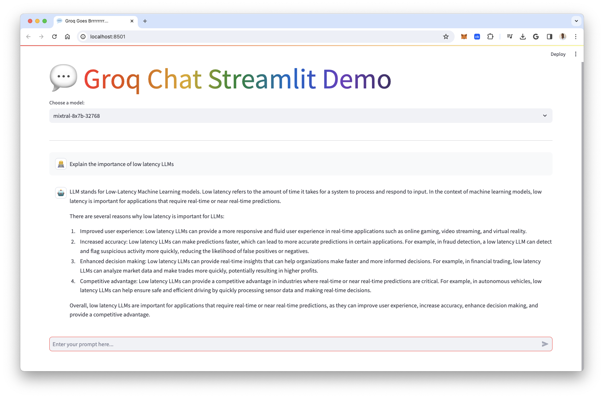

# AI Chatbot Groq

A Streamlit application that provides a chat interface to interact with various large language models (LLMs) using the Groq API. This application allows users to select different models, adjust response length, and engage in real-time conversations with AI.

## Features

- **Multiple Model Selection:** Choose from a variety of cutting-edge language models.
- **Dynamic Token Adjustment:** Control the maximum length of the AI's responses.
- **Interactive Chat Interface:** Engage in conversations with selected LLMs.
- **Streaming Responses:** Receive AI responses in real-time for a smoother experience.
- **Chat History:** Keeps track of the current conversation.
- **Responsive Design:** Adapts to different screen sizes for ease of use.

## Getting Started

Follow these instructions to get a copy of the project up and running on your local machine.

### Prerequisites

- Python 3.7+
- Git

### Installation

1.  **Clone the repository:**
    ```bash
    git clone https://github.com/your-username/AI_chatbot_groq.git
    cd AI_chatbot_groq
    ```
    *(Note: Replace `your-username` with the actual username or organization name if different.)*

2.  **Create and activate a virtual environment (recommended):**
    ```bash
    python -m venv venv
    source venv/bin/activate  # On Windows use `venv\Scripts\activate`
    ```

3.  **Install the dependencies:**
    ```bash
    pip install -r requirements.txt
    ```

4.  **Set up your Groq API Key:**
    You need a Groq API key to run this application.
    - Go to [GroqCloud](https://console.groq.com/keys) to obtain your API key.
    - You can set your API key as an environment variable named `GROQ_API_KEY`.
      ```bash
      export GROQ_API_KEY='your_api_key_here'
      ```
    - Alternatively, you can create a `.env` file in the root of the project and add your API key there:
      ```
      GROQ_API_KEY='your_api_key_here'
      ```
      The application uses `python-dotenv` to load this key if the environment variable is not set.

## Usage

Once you have completed the installation and set up your API key, you can run the Streamlit application:

```bash
streamlit run app.py
```

Open your web browser and navigate to the local URL provided by Streamlit (usually `http://localhost:8501`).

## Models Available

The application supports several models provided by Groq. You can select your preferred model from the dropdown menu in the app.

| Model ID                | Name                        | Max Tokens | Developer |
| ----------------------- | --------------------------- | ---------- | --------- |
| `gemma2-9b-it`          | Gemma2-9b-it                | 8192       | Google    |
| `llama-3.3-70b-versatile` | LLaMA3.3-70b-versatile      | 128000     | Meta      |
| `llama-3.1-8b-instant`  | LLaMA3.1-8b-instant         | 128000     | Meta      |
| `llama3-70b-8192`       | LLaMA3-70b-8192             | 8192       | Meta      |
| `llama3-8b-8192`        | LLaMA3-8b-8192              | 8192       | Meta      |
| `mixtral-8x7b-32768`    | Mixtral-8x7b-Instruct-v0.1  | 32768      | Mistral   |

*Token limits and model availability are subject to change based on Groq API updates.*

## Screenshot

Here's a demo of the application interface:



## Contributing

Contributions are welcome! If you have suggestions for improvements or want to add new features, please feel free to:

1.  Fork the repository.
2.  Create a new branch (`git checkout -b feature/YourFeature`).
3.  Commit your changes (`git commit -m 'Add some YourFeature'`).
4.  Push to the branch (`git push origin feature/YourFeature`).
5.  Open a Pull Request.

## License

This project is open-source and available under the [MIT License](LICENSE).

*(Note: You may want to add a `LICENSE` file with the full text of the MIT License or choose another license as appropriate.)*
